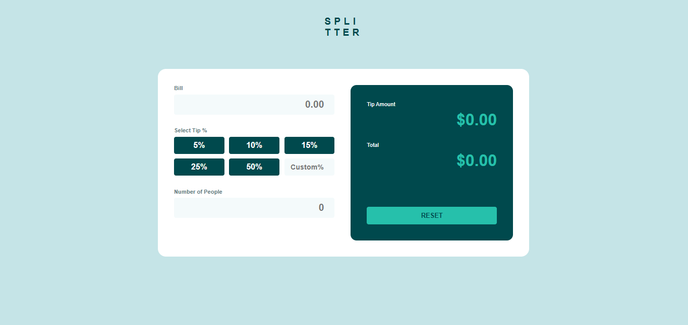

# Frontend Mentor - Tip calculator app solution

This is a solution to the [Tip calculator app challenge on Frontend Mentor](https://www.frontendmentor.io/challenges/tip-calculator-app-ugJNGbJUX). Frontend Mentor challenges help you improve your coding skills by building realistic projects.

## Table of contents

- [Overview](#overview)
  - [Screenshot](#screenshot)
  - [Links](#links)
- [My process](#my-process)
  - [Built with](#built-with)
  - [What I learned](#what-i-learned)
  - [Continued development](#continued-development)
  - [Useful resources](#useful-resources)
- [Author](#author)
- [Acknowledgments](#acknowledgments)

## Overview
This is a tip calculator app. So basically the function is thus: when you go out with friends and you are planning on how to pay, but also plan to tip the waiter and determining how much each person will pay is difficult and you can't figure out the exact amount that's where Tip calculator comes in. It helps you do exactly that, so all you have to do is input your bill, the percentage you want to tip the waiter and how many of you are paying then it does all the calculation telling you exactly how much the tip is being paid per person and the final bill also per peron.

### Screenshot

### Links
- Solution URL: (https://github.com/Blaise767/Tip-Calculator)
- Live Site URL: (https://blaise767.github.io/Tip-Calculator/)

## My process
I first started with doing just the html and deciding what needed to go where and how and a lot of mapping with my head but being the efficient user of AI that I am already nowing the basics and the main objective i put my resources into AI and used it as a helper in places I got stuck and to help me check my work in case of any errors of mistakes. Then I procedded on to css(which is my favourite cause you really can just do anything and see it come alive immediately in css) and then I continued on with css learning a few new keywords that my AI suggested in order to make my work better. And finally I put the functionality, the workings and the calculation in with javascript which is a bit complex and wide but since I wasn't doing a huge work it was quite easy

### Built with

- Semantic HTML5 markup
- CSS custom properties
- CSS Grid
- JavaScript

### What I learned
I leant a lot of new tags like @media and mostly javascript and how to add functionality it was honestly an enlightening project

### Continued development
I want to build lots of apps that are really helpful and mostly paid for and i want to make them for free because you never know u might need something but the lack of it might cause a heavy drawback or some negative effects. I also plan to build a sorta personal JARVIS which i know will take time and resoorces but is a work in progress.

### Useful resources

- [ChatGPT](https://chatgpt.com) - This helped me understand my code better, cross-check my work for errors, and complete the project efficiently.

## Author

- Email - [Osinakachi Blaise Mmeje](mailto:osinakachimmeje@gmail.com)
- Instagram - [blaise_4life](https://instagram.com/blaise_4life)
- Twitter - [@blaise_4life](https://www.twitter.com/blaise_4life)

## Acknowledgments
I want to say thanks to 0xverse for an amazing journey. The one month i spent there was a great one, learnt a lot, made friends, made memories and it was a special experience.. I also want to say a special thanks to Miss.Glory, Mr.Victor, Mr.Moses and Mr.Chris they have been wonderful instructors and i wish them a good life ahead.
